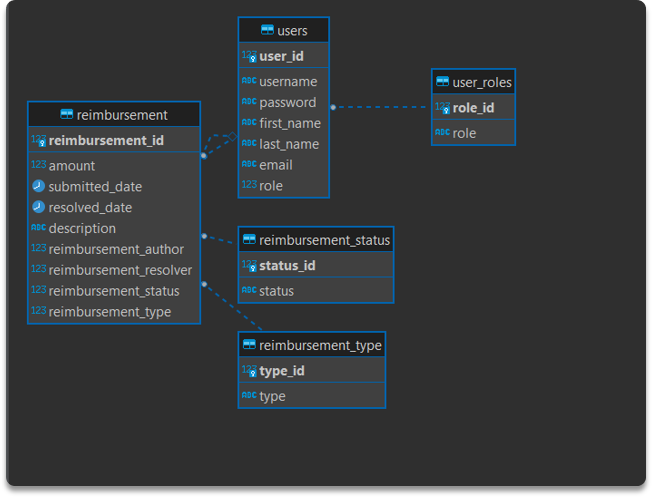

# Expense-Reimbursement-System

## Project Description

This Expense Reimbursement System will manage the process of reimbursing employees for expenses incurred. The employees can login and submit their requests for reimbursement, and they can view their past tickets and their pending requests. Finance managers can log in as manager account. They can view all reimbursement requests and past history for all employees in the company. Finance managers are authorized to approve and deny the requests for expense reimbursement.

## Technologies Used

* Typescript, HTML, CSS
* React
* Gradle
* Java
* JDBC
* JUnit
* Javalin
* Etc

## Getting Started
Setting the database same as the following image, for mathcing Object models (User and Reimbursement) 

Open the Project01 folder using Intellij, and write the URL, name, etc. in application.properties to connect the database, and run "Driver.java"

Open the project01-frontend folder using Visual Studio Code
- You need to install the react package(s) if there is error in import statement, type "npm install" in terminal
- Type "npm start" in terminal to open the front-end page

## As an employee, the user cam 
Login as an employee
Logout
View the home page, and able to view, and update his/her account information 
Submit a reimbursement request
View pending reimbursement requests he/she send 
View resolved(approved/deny) reimbursement requests he/she send

## As a manager, the user can:
Login as a manager 
Logout
View the manager home page
Approve/Deny pending reimbursement requests
View all pending requests of all employees
View all resolved (Approve/Deny ) requests of all employees
View reimbursement requests of a specific employee

## The application follow the layered architecture that has 
- Controller
- Dao layer
- Models layer
- Service layer

##  Testing
- Have over 75% test coverage of service classes

## Future Feathers
Add the function: 
The reimbursement application could send message to entered email in database, letting employees know that they have been registered as a new user
